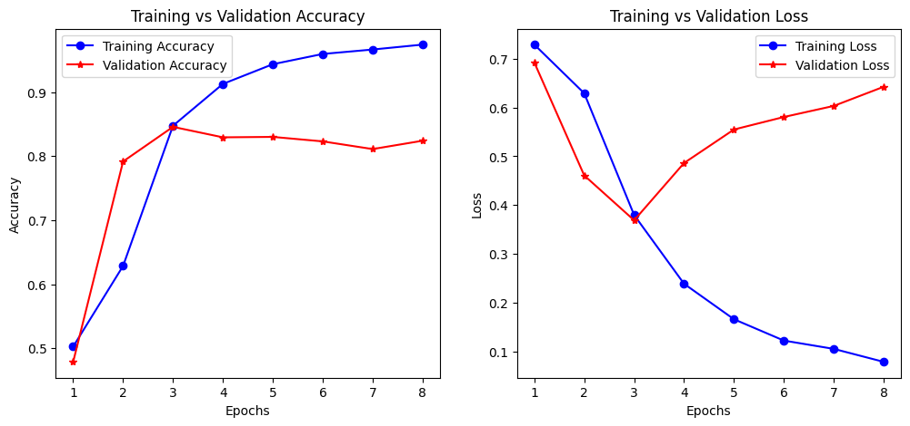
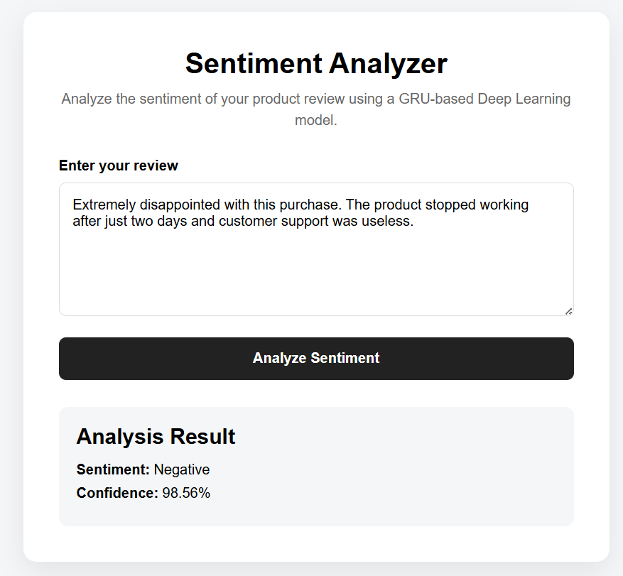

# Amazon Sentiment Analysis: SimpleRNN vs LSTM vs GRU

An end-to-end Deep Learning project that compares **SimpleRNN, LSTM, and GRU architectures** for binary sentiment classification of Amazon product reviews.

The project evaluates the performance of different recurrent neural network architectures and deploys the best-performing model using a **Flask web application**.

---

## Project Overview

Sentiment analysis is a Natural Language Processing task used to determine whether a piece of text expresses a positive or negative sentiment.

In this project, three recurrent neural network architectures were trained and compared:

* SimpleRNN
* LSTM
* GRU

The models were evaluated using:

* Accuracy
* Precision
* Recall
* F1 Score
* Confusion Matrix
* Training and Validation Curves

The best-performing model was then integrated into a Flask-based web application for real-time sentiment prediction.

---

## Model Architecture Comparison

The project follows the same preprocessing pipeline for all models to ensure a fair comparison.

```text
Amazon Reviews
      ↓
Label Extraction
      ↓
Text Cleaning
      ↓
Lowercasing
      ↓
Special Character Removal
      ↓
Stopword Removal
      ↓
Stemming
      ↓
Tokenization
      ↓
Sequence Padding
      ↓
SimpleRNN / LSTM / GRU
      ↓
Performance Evaluation
      ↓
Best Model Selection
      ↓
Flask Web Application
```

---

## Dataset

The project uses the Amazon Reviews dataset.

Each review contains a sentiment label:

```text
__label__1 → Negative Review
__label__2 → Positive Review
```

The labels were converted into binary values:

```text
Negative → 0
Positive → 1
```

A subset of the dataset was used for training and evaluation.

* Training Samples: 12,000
* Test Samples: 3,000

---

## Text Preprocessing

The following preprocessing steps were applied:

1. Convert text to lowercase
2. Remove special characters
3. Tokenize reviews
4. Remove English stopwords
5. Apply Porter Stemming
6. Convert words into integer sequences
7. Apply sequence padding

### Example

```text
Original Review:

"This product is absolutely amazing!"

        ↓

Cleaned Review:

"product absolut amaz"
```

---

## Models

### 1. SimpleRNN

SimpleRNN processes sequential information by maintaining a hidden state.

```text
Input
  ↓
Embedding Layer
  ↓
SimpleRNN
  ↓
Dense Layer
  ↓
Sentiment Prediction
```

While SimpleRNN can capture sequential patterns, it may struggle with long-term dependencies.

---

### 2. LSTM

Long Short-Term Memory networks use gating mechanisms to retain important information over longer sequences.

```text
Input
  ↓
Embedding Layer
  ↓
Bidirectional LSTM
  ↓
Bidirectional LSTM
  ↓
Dense Layer
  ↓
Sentiment Prediction
```

LSTM addresses the vanishing gradient problem commonly associated with traditional RNNs.

---

### 3. GRU

Gated Recurrent Units use update and reset gates to capture sequential dependencies with a simpler architecture compared to LSTM.

```text
Input
  ↓
Embedding Layer
  ↓
GRU Layers
  ↓
Dense Layer
  ↓
Sentiment Prediction
```

GRU achieved the best overall performance in this experiment.

---

# Results

## Model Performance Comparison

| Model      |   Accuracy |  Precision |     Recall |   F1 Score |
| ---------- | ---------: | ---------: | ---------: | ---------: |
| SimpleRNN  |     66.13% |     66.11% |     66.13% |     66.11% |
| LSTM       |     82.40% |     82.45% |     82.40% |     82.41% |
| **GRU 🏆** | **84.57%** | **84.61%** | **84.57%** | **84.54%** |

### Key Observation

GRU achieved the highest overall performance with:

```text
Accuracy: 84.57%
F1 Score: 84.54%
```

The results demonstrate that gated recurrent architectures such as LSTM and GRU significantly outperform a standard SimpleRNN for sequential sentiment classification.

---

## Performance Visualization

### Training vs Validation Accuracy and Loss - GRU


 
---

# Confusion Matrix Results

### SimpleRNN

```text
[[909, 528],
 [488, 1075]]
```

Accuracy: **66.13%**

---

### LSTM

```text
[[1194, 243],
 [285, 1278]]
```

Accuracy: **82.40%**

---

### GRU

```text
[[1172, 265],
 [198, 1365]]
```

Accuracy: **84.57%**

The GRU model demonstrated the strongest overall classification performance.

---

# Web Application

The best-performing GRU model was saved and integrated into a Flask-based web application.

The application allows users to enter a product review and receive:

* Predicted Sentiment
* Model Confidence Score

### Application Workflow

```text
User Review
     ↓
Flask Application
     ↓
Text Preprocessing
     ↓
Tokenizer
     ↓
Sequence Padding
     ↓
GRU Model
     ↓
Prediction Probability
     ↓
Positive / Negative Sentiment
     ↓
Confidence Score
```

### Web Application Screenshot




# Project Structure

```text
Amazon-Sentiment-Analysis-RNN-LSTM-GRU/
│
├── app.py
├── requirements.txt
├── README.md
├── .gitignore
│
├── models/
│   ├── best_model_gru.keras
│   └── tokenizer.pkl
│
├── notebooks/
│   └── amazon_sentiment_analysis.ipynb
│
├── templates/
│   └── sentiment_page.html
│
├── static/
│   └── style.css
│
└── images/
    ├── model_comparison.png
    ├── accuracy_plot.png
    ├── loss_plot.png
    └── web_app.png
```

---

# Installation

Clone the repository:

```bash
git clone https://github.com/YOUR_USERNAME/Amazon-Sentiment-Analysis-RNN-LSTM-GRU.git
```

Navigate to the project directory:

```bash
cd Amazon-Sentiment-Analysis-RNN-LSTM-GRU
```

Install dependencies:

```bash
pip install -r requirements.txt
```

Download NLTK stopwords:

```python
import nltk
nltk.download("stopwords")
```

Run the Flask application:

```bash
python app.py
```

Open the application in your browser:

```text
http://127.0.0.1:5000
```

---

# Technologies Used

### Deep Learning

* TensorFlow
* Keras

### NLP

* Tokenization
* Sequence Padding
* Stopword Removal
* Porter Stemming

### Deep Learning Models

* SimpleRNN
* LSTM
* GRU

### Backend

* Flask

### Frontend

* HTML
* CSS

### Data Processing

* NumPy
* Pandas
* NLTK

### Model Evaluation

* Scikit-learn
* Matplotlib

---

# Key Learnings

Through this project, I gained hands-on experience with:

* Natural Language Processing pipelines
* Text preprocessing
* Tokenization and sequence padding
* Word embeddings
* SimpleRNN architecture
* LSTM architecture
* GRU architecture
* Long-term dependency handling in sequential data
* Model evaluation and comparison
* Confusion matrices and classification metrics
* Saving trained Deep Learning models
* Tokenizer serialization
* Building a Flask-based ML application
* Deploying a trained model for local inference

---

# Future Improvements

Possible improvements include:

* Training on a larger subset of the dataset
* Using pre-trained word embeddings such as GloVe
* Hyperparameter optimization
* Adding attention mechanisms
* Implementing Transformer-based models
* Adding neutral sentiment classification
* Deploying the application to a cloud platform
* Containerizing the application using Docker

---

# Author

**Shravan Kundap**

Electronics & Telecommunication Engineering Student
Aspiring AI/ML Engineer

---

## If you found this project interesting, feel free to star the repository!
